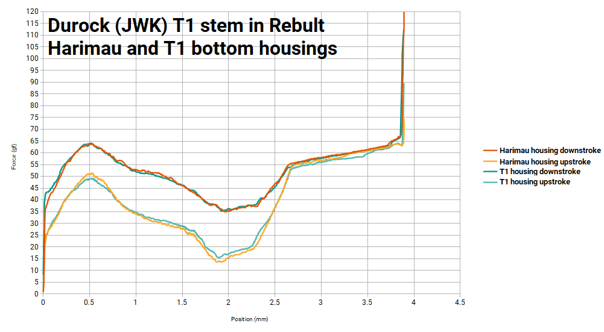

Here are the force curves I have so far. This page is frequently updated. The force curves here (the PNG and .ods files) are licensed under the [Creative Commons 4.0 license](https://creativecommons.org/licenses/by/4.0/). 

If you don't know how to read a force curve, [HaaTa](https://www.keebtalk.com/t/how-to-read-a-force-curve/65) and [ThereminGoat](https://www.theremingoat.com/blog/a-beginners-guide-to-force-curves) have good intro articles.

I am planning a reorganization of this page soon, as it is getting quite long now. Until then - Ctrl-F is probably the best way to navigate this.

# Stock Switches

Adobau Labs x JWK Bouquet:

AEBoards Naevy R1.5 (missing contact):

AEBoards Naevy R2:

Aflion Iceberg:

Akko x KTT CS Jelly Black:

Akko x KTT CS Jelly Blue:

Akko x KTT CS Jelly Pink:

Akko x KTT CS Jelly Purple:

Akko x KTT CS Jelly White:

Akko x KTT CS Ocean Blue:

Akko x KTT CS Lavender Purple:

Akko x KTT CS Radiant Red:

Akko x KTT CS Sponge:

Akko x KTT CS Starfish:

Akko x KTT CS Vintage White:

Alphakeys x BSUN POM Glacier Panda:

Alphakeys Dusk Panda:

AregKeyboards x Kailh Purple Potato:

Aula Matcha:

Aula Wooden Blue:

C3 Equalz x JWK Kiwi:                             

Cherry MX Black Hyperglide:

Cherry MX Blue Hyperglide:

Cherry MX Blue RGB:

Cherry MX Brown Hyperglide:

Cherry MX Red:

Durock (JWK) Blue Macaw:

Durock (JWK) Cerulean:

Durock (JWK) Daybreak:

Durock (JWK) Dolphin:

Durock (JWK) Koala 67gf:

Durock (JWK) Medium Tactile:

Durock (JWK) Lilac Tactile:

Durock (JWK) Linear 55g:

Durock (JWK) Linear 62g:

Durock (JWK) Linear 65g:

Durock (JWK) Linear 67g:

Durock (JWK) Linear 78g:

Durock (JWK) Lupine:

Durock (JWK) POM Linear:

Durock (JWK) Shrimp (Silent T1):

Durock (JWK) Sunflower (POM T1):

Durock (JWK) T1:

Durock (JWK) T1 Dark Amber:

Durock (JWK) Taro Ball:

Everglide Aqua King 55g:        

Everglide Bamboo:

Everglide Dark Jade (Moyu Black):

Gateron Aliaz:                        

Gateron Blue:                             

Gateron Brown:

Gateron Cap Brown:

Gateron Cap Yellow:                         

Gateron Cap Yellow Milky V2:

Gateron CJ:                 

Gateron G-Pro Yellow:

Gateron Green:              

Gateron Ink Red V2:

Gateron Ink Yellow:

Gateron Ink Yellow V2:

Gateron Kangaroo:
 

Gateron Limbo:                    

Gateron Milky Black:

Gateron Milky Blue:

Gateron Milky Clear:

Gateron Milky Red:

Gateron Milky Yellow:

Gateron Oil King:

Gateron Silver Blizzard:

Gateron Slate:                                     

Gazzew x Outemu Boba U4 62gf:

Gazzew x Outemu Boba U4 68gf:

Gazzew x Outemu Boba U4 Thock (U4T) 62gf:

Gazzew x Outemu Boba U4 vs U4 Thock (U4T) 68gf:

Gazzew x Outemu Bobagum 52gf:

Gazzew x Outemu Phoenix Stem in Boba housing:

*(I was split as to whether this was a franken, but it is a combo that is buildable out of parts that Gazzew sells, and isn't sold as a complete switch)*
Gazzew x Outemu Silent Tactile - Silent Sky V2.2 stem in Gazzew/Outemu Boba Housing:

Grain Gold Neon V2:
![Grain Gold Neon V2]
(https://github.com/bluepylons/Open-Switch-Curve-Meter/blob/main/Force%20curve%20measurements/Grain-Gold-Neon-V2.png?raw=true)

Huano Cyan:                             

Huano Dustproof Pink (Grey Bottom):

Huano x Old Tom Holy Tom:

Huano Hot Pink:

Huano Lilac:

Huano Orange:

Huano Smoky Pink:

Huano Smoky White:

Huano Strawberry Jelly V4:
![Hanuo Straberry Jelly V4]
(https://github.com/bluepylons/Open-Switch-Curve-Meter/blob/main/Force%20curve%20measurements/Huano-Strawberry-Jelly-V4.png?raw=true)

Jerrzi Blue:
![Jerrzi Blue]
(https://github.com/bluepylons/Open-Switch-Curve-Meter/blob/main/Force%20curve%20measurements/Jerrzi-Blue.png?raw=true)

Jerrzi Kyria Brown:
![Jerrzi Kyria Brown]
(https://github.com/bluepylons/Open-Switch-Curve-Meter/blob/main/Force%20curve%20measurements/Jerrzi-Kyria-Brown.png?raw=true)

Jwick (JWK) Black T1: 

JWK Alpaca "V2":

JWK Pewter:        

(Proposed) JWK Twilight:

JWK Twilight (prototype vs actual GB vs JWK Medium Tactile):

Kailh x Archon Art Box Brown:

Kailh Box Silent Brown:

[Kailh Choc switches](https://github.com/bluepylons/Open-Switch-Curve-Meter/blob/main/Force%20curve%20measurements/Kailh%20Choc%20Switches/README.md)

Kailh Polia:                      

Kailh Speed Pale Blue:

Keebfront x Meirun Doom:

KTT Gold:                            

KTT Grapefruit:                  

KTT HaluHalo:

KTT Mallo:                          

KTT Matcha:                                                   

KTT Monochrome Chalk:

KTT Monochrome Marble:

KTT Monochrome Onyx:

KTT Peach:            

KTT Rose:            

KTT Sea Salt Lemon:

KTT Soot (Ash):

KTT Strawberry:

LCET Blue Pink:

Mechs on Deck x JWK Anubis:

MiTo x KBDfans x Gateron Laser 60g:

MiTo x KBDfans x Gateron Laser 60g:

Momoka Frog:              
    

Moyu.studio x acitrin, Chris @ Mechs & Co, and stellaidoscope x JWK Commute:
 

Moyu.studio x JWK Hades:
 

Moyu.studio x JWK Poseidon:
 

Moyu.studio x JWK Queen:
 

Novelkeys x JWK Silk Yellow:

NovelKeys x Kailh Blueberry:

NovelKeys x Kailh Box Cream:
 

NovelKeys x Kailh Box Jade:
 

NovelKeys x Kailh Box Navy:

NovelKeys x Kailh Chocolate:

NovelKeys x Kailh Sherbet:

NovelKeys x Kailh Speed Navy:

Old Tom x Haimu Ice Edge:

Old Tom x Haimu Ice Edge (Powder):

Outemu Ice Purple 62gf:

Outemu Silent Sky V2.2 68gf:

Qwertyqop x JWK Quartz V1:

Rebult x JWK Harimau:

Rebult x JWK Penyu:

Redragon x Haimu Sea Salt Lemon:

Redragon x Haimu Thin Lemon:

SP Star x Kon MOMO: 

SP Star Magic Girl Classic:

SP Star Meteor Orange:

SP Star Purple:

Team Wolf Blue:
![Team Wolf Blue]
(https://github.com/bluepylons/Open-Switch-Curve-Meter/blob/main/Force%20curve%20measurements/Team-Wolf-Blue.png?raw=true)

Tecsee Blue Velvet Linear:

Tecsee Blue Velvet Tactile:

Tecsee Coffee Chip Ice Cream:

Tecsee Diamond:           

Tecsee Ice Candy:           

Tecsee Ice Grape:           

Tecsee Kingfisher:

Tecsee Lychee:

Tecsee Neapolitan Ice Cream:

Tecsee Porcelain Blue 53gf:

Tecsee Ruby V1:

Tecsee Sapphire V1:

Tecsee Strawberry Milk Tactile:

Tecsee Strawberry Milk Linear:

TKC x Tecsee Blackberry:

TTC Bluish White:

TTC Flaming Purple (POK stem):
![TTC Flaming Purple]
(https://github.com/bluepylons/Open-Switch-Curve-Meter/blob/main/Force%20curve%20measurements/TTC-Flaming-Purple-POK-Stem.png?raw=true)

TTC Gold Brown:

TTC Gold Pink:

TTC Golden Blue:

TTC Light Cloud V2:
![TTC Light Cloud V2]
(https://github.com/bluepylons/Open-Switch-Curve-Meter/blob/main/Force%20curve%20measurements/TTC-Light-Cloud-V2.png?raw=true)

TTC Watermelon Milkshake:

Velocifire x KK Lightwave V2:
         
*(I initially thought my sample had a bent leaf as these actuate much earlier than at the 2.0mm advertised, but there are [other reports](https://www.youtube.com/watch?v=oTu_R-ibhw4) of these switches actuating much earlier than specified.*

ZealPC x Gateron Tealio V2 67g:

ZealPC x Gateron Zealio V2 62g:

ZealPC x Gateron Zealio V2 65g:

ZealPC x Gateron Zealio V2 67g:

# Frankenswitches 

Cherry MX Blue stem in Durock Koala (T1) housing:

Cherry MX Brown stem in Gazzew/Outemu Boba  housing: 

Cherry MX Clear stem in Cherry MX Blue housing:

Cherry MX Clear stem with Cherry MX :

Cherry MX Clear stem with Cherry MX Blue RGB bottom housing, old Cherry MX black top:

Cherry MX Clear stem in various housings:

Durock (JWK) Cobalt stem in Durock POM linear housing:

Durock (JWK) T1 stem in Durock (JWK) Medium Tactile housing:

Durock (JWK) T1 stem in Kailh Pro Purple housing:

Durock (JWK) T1 stem and top in Rebult Harimau bottom housing:

Feker Holy Panda stem (Halo clone) in Cherry MX Blue housing - "Holy Chickie" 

Feker Holy Panda stem (Halo clone) in Durock Koala (T1) housing - "Holy T1":

Feker Holy Panda stem (Halo clone) in Gazzew Boba housing - "Holy Boba" 

Feker Holy Panda stem (Halo clone) in NK x Kailh Blueberry housing - sort of a "Paco" (technically supposed to use an NK x Kailh Cream housing, but the housings are supposedly identical)

Feker Holy Panda stem (Halo clone) in Zeal Zealio Bottom Housing, Gazzew Boba top - "Byko":

Feker Holy Panda stem (Halo clone) in Zeal Zealio Bottom Housing, Cherry top - variant of a "Zyko" I guess:

Feker Smokey Tactile stem in Durock (JWK) T1 housing:

Gateron Blue (Jailhouse modded):

Gazzew x Outemu Phoenix stem in Cherry MX Blue housing:

Gazzew x Outemu Phoenix stem in Durock T1 housing:

Gazzew x Outemu Phoenix stem in Outemu Blue Ice housing:

Gazzew x Outemu Phoenix stem in Outemu Sky housing:

Gazzew U4 stem in Cherry MX Blue housing:

Gazzew U4 stem in Cherry MX Clear housing:

Gazzew U4T stem, Kailh Polia stem, and Input Club x Kailh Halo Clear stem, in Boba housing:
)

Input Club Halo Clear stem in Gazzew Boba housing - "Holy Boba"

Input Club Halo Clear stem in Gazzew Boba housing w/ ThicThock DL 63.5+ spring - "Holy Boba"

Input Club Halo Clear stem in Jwick T1 bottom w/ Gazzew Boba top and ThicThock DL 63.5+ spring - "Holy T1" variant

JLabs Aura, Gazzew x Outemu Boba U4T, Input Club x Kailh Halo, and Kailh Polia stems in Alphakeys x BSUN POM Glacier Panda housing:

JLabs Aura, Gazzew x Outemu Boba U4T, Input Club x Kailh Halo, and Kailh Polia stems in Cherry MX Blue housing:

JLabs Aura, Gazzew x Outemu Boba U4T, Input Club x Kailh Halo, and Kailh Polia stems in Gazzew x Outemu Boba housing:

JLabs Aura, Gazzew x Outemu Boba U4T, Input Club x Kailh Halo, and Kailh Polia stems in Gazzew x Outemu Boba housing:

Kailh Polia stem in Zealio V2 bottom, Cherry top, 65gf Zealio V2 spring - "Zyko" variant:

Kailh Pro Burgundy stem in Gateron KS-3 bottom, Gazzew Boba top - "Deadpool":

Kailh Pro Purple stem in Durock T1 housing:

Kailh Pro Purple stem in Durock T1 bottom housing, Cherry top housing:

Kailh Pro Purple stem in Durock T1 bottom housing, Gateron Milky top housing:

Kailh Pro Purple stem in Durock T1 bottom housing, older Gazzew Boba top housing:

Kailh Pro Purple stem in Durock T1 bottom housing, Outemu Clear no-slot (tight) top housing:

Kailh Pro Purple stem in Durock T1 bottom housing, Outemu Clear slotted top housing:

Kailh Speed Pale Blue stem in Novelkeys x Kailh Sherbet housing:

Novelkeys x Kailh Blueberry stem in Gazzew x Outemu Boba housing, Cherry MX Grey 110g spring:

Novelkeys x Kailh Blueberry stem in Outemu Sky housing, Gazzew x Outemu Boba top:

Novelkeys x Kailh Blueberry stem in Tecsee Lychee housing:

Novelkeys x Kailh Cream stem in JWK Alpaca "V2" housing:

Outemu Purple (Dustproof) Stem in Boba Housing :

Outemu Silent Sky V2.2 stem in Cherry MX Blue housing:

Outemu Silent Sky V2.2 stem in Cherry MX Clear housing:

Outemu Silent Sky V2.2 stem in Durock (JWK) T1 housing:

Tecsee Blue velvet Linear stem in JWK Lavender Linear housing:

Tecsee Blue Velvet Linear stem in HK Gaming MS1 top, Mode x JWK Signal bottom:
  

TG3 "Copre" rubber dome over springless Gateron Yellow:

TG3 "Copre" rubber dome over NK Blueberry Stem in Gazzew Boba housing:

TG3 "Copre" rubber dome over springless Kailh Box Navy:

# Springs

* Note that springs may measure differently depending on the housing they are installed in, as different housings may preload the spring differently. This is discussed in somewhat in [this KeebTalk thread](https://www.keebtalk.com/t/how-to-best-mimic-gateron-yellow-weight-in-a-jwk-housing/17052). See the graphs in the **Other** section below. 

Kelowna 2-stage 58g:

KTT Kang White spring:

Kinetic Labs Symmetric Long 63.5g:

New Gazzew 55gf, 65gf, and 72gf springs:
.png?raw=true) 

Redacted progressive spring (this was sent to me but is not publicly released yet, hence details are redacted):
 

SPRiT 63.5gf Complex and Progressive Springs, compared with Gateron Yellow Spring, no leaf:

SPRiT 63.5gf Complex and Progressive Springs, compared with Gateron Yellow Spring, with leaf:

SPRiT Slow Extreme II 63.5g:

Tecsee Ruby V1 spring:

Thic Thock 68gf MP, no leaf:

Thic Thock 68gf MP, with leaf:

Various ~63.5gf springs (Durock, Gateron Yellow, various SPRiT)

Various 67-70gf springs (Moyu Black, Durock 67g, Thic Thock DL 67.5g, Thic Thock MP 68g, Outemu 68g, TX 70g 14mm)

Various ~90gf springs:

Various Durock springs:

(the 62g and 63.5g are not mislabelled - I measured two of each and the two 63.5g springs I measured do measure lighter than the 62g springs)

Various very long springs:

Various SPRiT springs:

Various TX springs:

# Other

Effects of different switches on different springs - Gateron Yellow (slow), Moyu x JWK Queen (3-stage), and Cherry MX C lear (short) springs insid Gateron Yellow and Moyu x JWK Queen switches. This is discussed in somewhat in [this KeebTalk thread](https://www.keebtalk.com/t/how-to-best-mimic-gateron-yellow-weight-in-a-jwk-housing/17052).

Effects of the ["Paper Mod"](https://www.reddit.com/r/switchmodders/comments/iiigpx/leaf_mod_adjust_your_tactility_level_for_free/) on an Cherry MX Ergo Clear:

Gateron Yellow with and without its leaf:

Slow versus fast spring comparison - Cherry MX Clear with stock 90gf spring and with Kailh Speed Pale Blue spring:

# Other sources of force curve measurements 
* HaaTa has force curve measurements [on Plotly](https://chart-studio.plotly.com/~haata#/)
* Ruddy (of Geekboards.ru) has force curve measurements on Github [here](https://github.com/geekboards/switch-force-tester/tree/main/python-app/results) 
* ThereminGoat now has a force curve meter and posts measurements on GitHub [here](https://github.com/ThereminGoat/force-curves)
